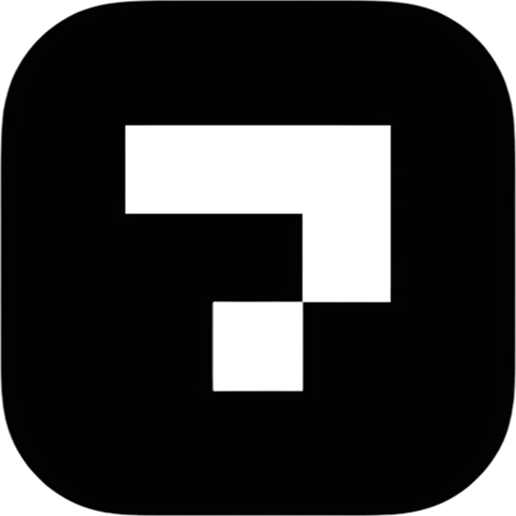

# 🌟 NativeSquare Studio

A premium Next.js marketing website for **NativeSquare Studio** - Your full-service software agency and app studio. We transform ideas into market-successful products with end-to-end development, go-to-market strategy, and conversion-optimized sales funnels.



## 🚀 Tech Stack

- **Framework**: Next.js 16 (App Router)
- **Runtime**: React 19
- **Language**: TypeScript
- **Styling**: Tailwind CSS v4
- **Icons**: Lucide React
- **Package Manager**: PNPM
- **Linting**: ESLint 9
- **Font**: Geist (optimized by Next.js)

## 🛠️ Development Setup

### Prerequisites

- **Node.js** 18+
- **PNPM** (recommended) or npm/yarn

### Installation

1. **Clone the repository**

   ```bash
   git clone <repository-url>
   cd website-3
   ```

2. **Install dependencies**

   ```bash
   pnpm install
   ```

3. **Start development server**

   ```bash
   pnpm dev
   ```

4. **Open your browser**
   ```
   http://localhost:3000
   ```

### Available Scripts

```bash
# Development
pnpm dev          # Start dev server with hot reload
pnpm build        # Build for production
pnpm start        # Start production server
pnpm lint         # Run ESLint
```

## 📁 Project Structure

```
src/
├── app/
│   ├── (site)/
│   │   ├── components/     # Reusable UI components
│   │   │   ├── Hero.tsx
│   │   │   ├── Features.tsx
│   │   │   ├── Testimonials.tsx
│   │   │   ├── FAQ.tsx
│   │   │   ├── About.tsx
│   │   │   ├── CTA.tsx
│   │   │   ├── Footer.tsx
│   │   │   ├── Navbar.tsx
│   │   │   └── MobileSection.tsx
│   │   ├── data/
│   │   │   └── config.ts    # Configuration constants
│   │   ├── hooks/
│   │   │   └── useScrollAnimation.ts
│   │   ├── about/
│   │   │   └── page.tsx
│   │   ├── blog/
│   │   │   └── [slug]/
│   │   ├── legal/
│   │   │   └── page.tsx
│   │   ├── portfolio/
│   │   │   └── [slug]/
│   │   ├── layout.tsx
│   │   └── page.tsx
│   ├── globals.css
│   ├── layout.tsx
│   └── favicon.ico
```

## 🎨 Key Features

- **Modern Design**: Clean, professional UI with smooth animations
- **Responsive**: Mobile-first design that works on all devices
- **Performance**: Optimized with Next.js 16 and React 19
- **TypeScript**: Full type safety throughout the application
- **Animations**: Custom scroll animations and micro-interactions
- **SEO Ready**: Optimized meta tags and structured data

## 🏗️ Components Overview

- **Hero**: Main landing section with animated background
- **Features**: Service offerings and capabilities
- **Testimonials**: Client reviews and success stories
- **FAQ**: Common questions and answers
- **About**: Company story and values
- **CTA**: Call-to-action sections
- **Footer**: Contact info and links
- **Navbar**: Responsive navigation with mobile menu

## 🚀 Deployment

### Vercel (Recommended)

1. Connect your GitHub repo to Vercel
2. Deploy automatically on push to main branch
3. Custom domain support included

### Manual Build

```bash
pnpm build
pnpm start
```

## 📊 Performance

- **Next.js 16**: Latest performance optimizations
- **React 19**: Concurrent features and improved rendering
- **Tailwind v4**: Faster CSS processing
- **Image Optimization**: Built-in Next.js optimization

## 🤝 Contributing

1. Fork the repository
2. Create a feature branch (`git checkout -b feature/amazing-feature`)
3. Commit your changes (`git commit -m 'Add amazing feature'`)
4. Push to the branch (`git push origin feature/amazing-feature`)
5. Open a Pull Request

## 📄 License

This project is private and proprietary to NativeSquare Studio.

## 📞 Contact

- **Website**: [nativesquare.studio](https://nativesquare.studio)
- **Email**: hello@nativesquare.studio
- **Upwork**: [View Portfolio](https://www.upwork.com/freelancers/~0135c21091b0e3745d)
- **Calendar**: [Book a Strategy Call](https://cal.com/nativesquare-office-orlgbk/30min)

---

_Built with ❤️ by NativeSquare Studio - From idea to market success_
